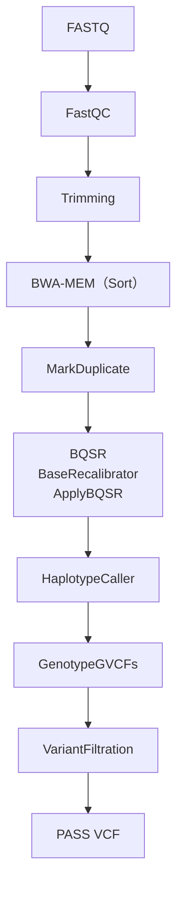

 

# ShortWGS

ヒトゲノム WGS解析マニュアル

ShortWGS は、GATK Best Practices をベースにしたヒトゲノム（GRCh38/hg38）ショートリード Whole Genome Sequencing（WGS）解析マニュアルです。  
Genome Analysis Toolkit（GATK）は、Broad Institute が開発しているゲノム解析ソフトウェアであり、NGSデータから SNP や INDEL などの遺伝子変異を高精度に検出するための標準的なツールとして広く利用されています。  
本マニュアルでは、GATK Best Practices を参考に、FASTQ ファイルから VCF ファイルの作成までの解析手順を解説します。  
解析例として、1000 Genomes Project が公開しているヒトゲノム WGS データ（NA18939）を使用しています。  

 

## ドキュメント

- [セットアップ　Windows編](セットアップ/Windows.md)
- [セットアップ　Mac編](セットアップ/Mac.md)
- [練習用データダウンロード](docs/1_データ類ダウンロード.md)
- [解析スクリプト](docs/2_WGS解析マニュアル.md)

 

## 練習用データ
本マニュアルでは 1000 Genomes Project の公開データを練習用として使用しています。  
Sample: NA18939  
Low Coverage WGS  
https://www.internationalgenome.org/data-portal/sample/NA18939  

 

## 主な解析内容
- FASTQ の品質評価（FastQC）
- リードトリミング（fastp）
- リファレンスゲノムへのマッピング（BWA-MEM）
- BAM のソート・重複処理（SAMtools / Picard）
- BQSR（Base Quality Score Recalibration）
- 変異検出（GATK HaplotypeCaller）
- SNP・INDEL のフィルタリング
- QCレポート作成（samtools / GATK / bcftools / MultiQC）

 

## 解析フロー

## 注意事項

実際の研究解析では、対象データや目的に応じてパラメータやフィルタリング条件の調整が必要です。

