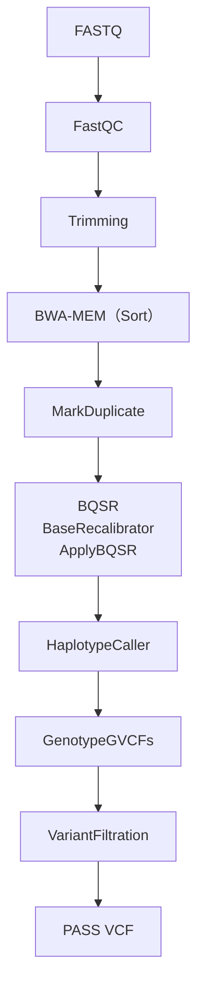

 

# ShortWGS
ヒトゲノム WGS解析マニュアル

GATK Best Practices をベースにした、ヒトゲノム（hg38）ショートリード Whole Genome Sequencing (WGS) 解析マニュアルです。  
FASTQ から VCF 作成までの解析手順をまとめています。  
本マニュアルではヒトゲノムリファレンス（GRCh38 / hg38）を使用し、1000 Genomes Project の公開 WGS データを例として解析を行います。  

 

## ドキュメント

- [環境構築](docs/01_セットアップ.md)
- [解析スクリプト](docs/02_WGS解析マニュアル.md)

 

## Workflow

